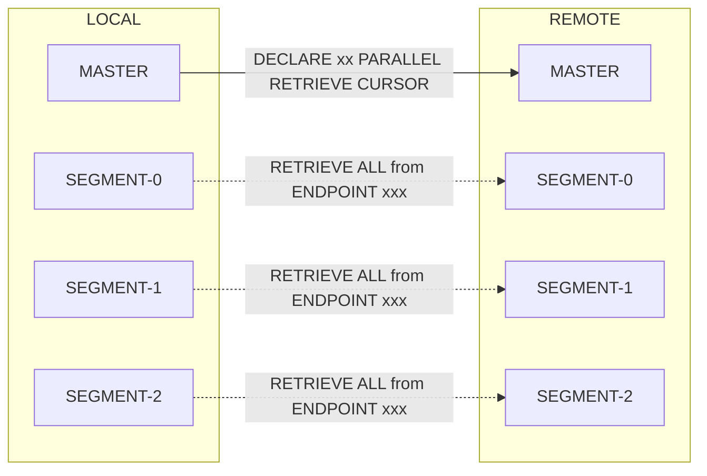

# cloudberry fdw

The cloudberry_fdw extension provides foreign data wrapper (FDW) capabilities for CloudberryDB.

It is designed to extend the functionality of the upstream postgres_fdw, while introducing modifications and optimizations required for Massively Parallel Processing (MPP) environments.

## Codebase

The `cloudberry_fdw` extension is derived from Cloudberry’s built-in `postgres_fdw`.
Its initial codebase was copied from the Cloudberry repository at the following commit:

```
Upstream repository: https://github.com/apache/cloudberry

Base path: contrib/postgres_fdw

Copied from commit: 7e00589f2a4391b4b58bc869c96094494db8165b
```

Since then, we have made significant modifications to adapt the extension for MPP (Massively Parallel Processing) environments in Cloudberry.

**Major enhancements**

1. Added support for parallel reads using the parallel retrieve cursor mechanism.

2. Added support for parallel writes.

**Maintenance**

`cloudberry_fdw` is maintained as an independent subdir in contrib.

Future updates from upstream postgres_fdw may be merged or referenced when necessary to keep compatibility.

## Overview

The key enhancement of `cloudberry_fdw` over `postgres_fdw` lies in its MPP-aware data access path.

Instead of routing all traffic through the QD (Query Dispatcher), `cloudberry_fdw` parallelizes both read and write operations across segments to fully utilize Cloudberry’s distributed architecture.

### Parallel Read
cloudberry_fdw parallelizes foreign scans using Cloudberry’s `parallel retrieve cursor` mechanism.

**Cursor Creation**

The local QD sends a `CREATE PARALLEL RETRIEVE CURSOR` to the remote coordinator.

The remote server creates a cursor and returns endpoint mappings.

**Segment Retrieval**

Each local QE sends `RETRIEVE ... FROM ENDPOINT ...` directly to its corresponding remote QE.

Tuples are streamed back to local QEs in parallel, bypassing the QD.

**Data Gathering**

Local QEs perform filtering or partial aggregation.

Results are sent through Cloudberry’s motion (interconnect) to the QD.

The QD merges partial results and produces the final output.

This design ensures that data retrieval scales with the number of segments, removing the master node as a bottleneck.



When performing parallel reads, there are three scenarios to consider:

* **Equal number of local and remote segments:**
Each local QE only needs to retrieve data from the corresponding remote segment.

* **Fewer local segments than remote segments:**
Each local QE is responsible for reading data from multiple remote segments.

* **More local segments than remote segments:**
The extra local QEs do not perform any data retrieval.

### Parallel Write

Foreign table write(insert/update/delete) operations are implemented through the PostgreSQL COPY protocol:

The QD initiates a BEGIN COPY FROM operation. Instead of reading data directly, it pulls tuples from a `cbcopy_helper` pipe.

> The SQL is roughly like this:
>
> **INSERT:** INSERT INTO ... SELECT * FROM cloudberry_fdw.cbdb_fdw_copy_from(...) AS t (...);
>
> **UPDATE:** UPDATE ... SET ... FROM (SELECT * FROM cloudberry_fdw.cbdb_fdw_copy_from(...) AS t (..., ctid tid, gp_segment_id integer)) l WHERE remote_table.ctid = l.ctid AND remote_table.gp_segment_id = l.gp_segment_id;
>
> **DELETE:** DELETE FROM ... USING (SELECT * FROM cloudberry_fdw.cbdb_fdw_copy_from(...) AS t (ctid tid, gp_segment_id integer)) l WHERE remote_table.ctid = l.ctid AND remote_table.gp_segment_id = l.gp_segment_id;

Each QE executes a COPY TO operation, streaming its partition of the data into the same `cbcopy_helper` pipe.

The helper acts as a distributed data exchange channel, enabling the QD to gather input from multiple QEs concurrently and forward it to the remote server.

With this design, writes are parallelized across segments, ensuring efficient and scalable data ingestion into the remote system.

## Tests
```bash
export PGPORT=7000
export COORDINATOR_DATA_DIRECTORY=/your/local/cluster/datadir
./run_regression_test.sh
```
